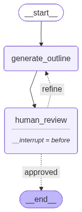
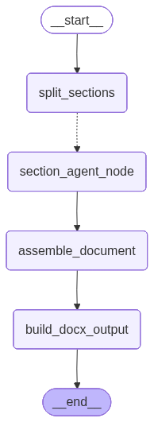

# Agentic AI Documentation Generator

A multi-agent LangGraph system that automates the creation of structured, multi-page technical documentation using **GPT-4o**, **Gemini 2.5 Flash**, and **DuckDuckGo**. The final output is a Word document (.docx).

## System Architecture

The architecture uses a Human-in-the-Loop (HITL) loop for outline approval, followed by a massive fan-out/fan-in parallel processing strategy to write sections.

### 1. Outline Graph (HITL)
The user provides a topic, description, and target page count. A planner agent drafts an outline, and execution is paused. The user can review the outline in the terminal, provide feedback to refine it iteratively, or approve it to move on.



### 2. Document Generation Graph (Parallelism)
Once approved, the outline is split into N parallel section-writing tasks (fan-out). Each `Section Agent`:
1. Searches the web (DuckDuckGo).
2. Scrapes the text of the top ranking page.
3. Retrieves relevant inline images directly from the web source, or embeds a `[IMAGE_PLACEHOLDER]` token if none exist.
4. Drafts the section prose.
5. Extracts structured metadata for references.

After all sections finish (fan-in), the `Assembler Agent` kicks in. It resolves all missing image placeholders via Google Gemini (`gemini-2.5-flash-image`), deduplicates all references, and builds the final `.docx`.



## Quickstart

**1. Install Dependencies**
```bash
python -m venv venv
# Windows:
.\venv\Scripts\activate
# Mac/Linux:
source venv/bin/activate

pip install -r requirements.txt
```

**2. Configure API Keys**
```bash
cp .env.example .env
```
Fill in your `OPENAI_API_KEY` and `GEMINI_API_KEY` in the `.env` file. (DuckDuckGo search requires no keys).

**3. Run the Generator**
```bash
python main.py
```
Follow the interactive prompts in the terminal to generate your documentation!

## Features

- **Terminal Human-in-the-Loop:** Don't like the generated outline? Ask the agent to add, remove, or change focus areas before any heavy processing begins.
- **Smart Image Strategy:** Avoids hallucinated images by scraping real image `src` tags from actual web articles first. Only uses Gemini generation as a fallback for missing graphics/diagrams.
- **Citations Formatting:** Automatic numeric inline citations and a compiled, deduplicated References section at the end of the document.
- **Deduplication Checks:** Ensures images are not reused across different sections via MD5 hashing.
- **Professional Formatting:** Fully justified text, capped image dimensions, and clean heading hierarchies.
